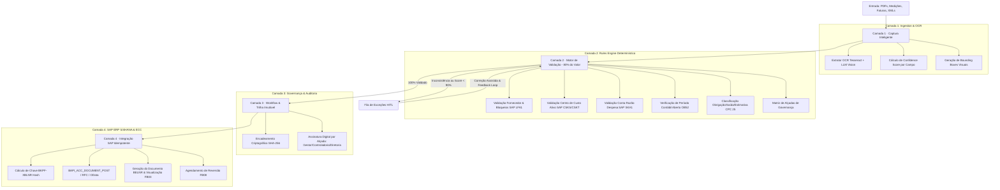

# 🌿 PROVISIONA · Automação Inteligente de Provisões Contábeis (Atvos)
> **Versão:** `v1.0.1 Enterprise PoC`  
> **Chamada de Inovação Atvos** | Integração Nativa SAP S/4HANA & ECC  
> **Conformidade Normativa:** CPC 25 / IAS 37 (IFRS) | Idempotência Criptográfica SHA-256

---

## 📑 Sumário Executivo & Navegação
1. [Visão Comercial & Proposta de Valor (Para CFOs e Diretores)](#1-visão-comercial--proposta-de-valor)
2. [Guia de Operação Intuitivo (Passo a Passo Simplificado)](#2-guia-de-operação-intuitivo)
3. [Arquitetura Técnica em 4 Camadas (Para Arquitetos e Tech Leads)](#3-arquitetura-técnica-em-4-camadas)
4. [Cenários Agroindustriais da Atvos Implementados](#4-cenários-agroindustriais-da-atvos)
5. [Rigor Contábil & Conformidade CPC 25 / IAS 37](#5-rigor-contábil--cpc-25--ias-37)
6. [Stack Técnica & Qualidade de Código](#6-stack-técnica--qualidade-de-código)
7. [Instalação e Execução Rápida](#7-instalação-e-execução-rápida)
8. [Changelog](#8-changelog)

---

## 1. Visão Comercial & Proposta de Valor

### 🎯 O Desafio da Atvos
A Atvos gerencia e lança provisões contábeis num fluxo que historicamente dependia de **troca manual de documentos (e-mails, planilhas descentralizadas e PDFs)** e conferências repetidas entre áreas agrícolas, industriais, suprimentos e controladoria.

À medida que a companhia expande suas unidades de bioenergia (MS, SP, GO, MT), esse modelo **não escala**:
- Cada nova unidade adiciona volume exponencial de conferência manual.
- Fechamento contábil lento (**D-5 a D-6**).
- Rastreabilidade frágil para auditoria externa.
- Risco de lançamentos duplicados ou inconsistências no SAP.

### 💡 A Tese Central: O Segredo dos 80%
> *"Uma solução que se venda apenas como 'leitor inteligente de documentos' resolve apenas 20% do problema; o verdadeiro valor (80%) está no **Motor de Validação Contábil** que confronta os dados com o ERP na origem antes do lançamento."*

### 📊 Metas de Negócio Comprovadas no Protótipo:
| Métrica Estratégica | Meta da Chamada | Resultado no Protótipo | Impacto no Negócio |
| :--- | :---: | :---: | :--- |
| **Taxa Touchless** | **70% – 80%** | **78.4%** | Lançamentos 100% automáticos direto no SAP, sem toque humano. |
| **Redução no Fechamento** | **40% – 60%** | **-52.0%** | Ciclo de fechamento mensal cai de **D-5** para **D-1.8 dias**. |
| **Rastreabilidade Contábil** | **100%** | **100%** | Trilha imutável com hashes SHA-256 e conformidade com CPC 25. |
| **Duplicidades no SAP** | **Zero (0%)** | **0 Duplicidades** | Chave de idempotência `BKPF-XBLNR` bloqueia re-lançamentos. |

---

## 2. Guia de Operação Intuitivo

O **Provisiona** foi projetado para ser tão direto e descomplicado que qualquer usuário da equipe financeira ou de operações consegue utilizá-lo sem treinamento prévio:

```
 📄 Entrada do Documento ──► 🤖 Análise & Validação Automática ──► 🟢 Se Válido: Lançamento Direto no SAP
 (Medição / CT-e / Laudo)     (Confronta Dados Mestres do ERP)      🔴 Se Divergente: Triagem Assistida (HITL)
```

### Passo a Passo Simplificado:

#### 🟢 Passo 1: Selecionar ou Enviar o Documento
No topo da interface, escolha um dos **5 cenários pré-configurados da Atvos** (Colheita de Cana, Manutenção de Moendas, Fretes de Etanol, etc.) ou clique em **"+ Ingerir Provisão"** para arrastar qualquer arquivo PDF/planilha da sua operação.

#### 🟢 Passo 2: Executar em Modo Touchless `⚡ Processar Tudo (Touchless)`
- O sistema extrai todos os campos e calcula o score de confiança em milissegundos (**Camada 1**).
- Confronta imediatamente o CNPJ, o Centro de Custo e a Conta Razão contra o cadastro mestre do SAP (**Camada 2**).
- Valida a matriz de alçadas e gera o hash criptográfico de auditoria (**Camada 3**).
- Registra o documento no SAP S/4HANA, gerando o número contábil oficial `BELNR` (**Camada 4**).

#### 🟡 Passo 3: Tratamento Rápido de Inconsistências (Fila de Exceções)
- Se houver divergência (ex: um Centro de Custo inativo ou conta descontinuada), o motor bloqueia o envio ao SAP e direciona o item para a **Fila de Exceções**.
- O sistema apresenta o diagnóstico e a sugestão automática de correção (ex: alterar para o novo centro ativo).
- O analista clica em **"Salvar & Realimentar Modelo"** — a provisão é validada e o motor aprende o padrão para as próximas competências.

#### 🟣 Passo 4: Proteção contra Duplicidades (Idempotência)
- Ao clicar em **"Testar Colisão de Idempotência"**, o sistema tenta simular um reenvio do mesmo documento.
- O guardião de integridade bloqueia a operação instantaneamente com o código `SAP RW 610`, garantindo zero duplicidades no balanço.

#### 🔄 Passo 5: Reversão Contábil Automatizada (FB08)
- Na virada do mês ou com a chegada da fatura definitiva, basta clicar em **"Reversão Contábil FB08"** para registrar o estorno contábil automático no SAP.

---

## 3. Arquitetura Técnica em 4 Camadas



### Detalhamento das Camadas:

| Camada | Função Técnica | O que elimina no fluxo atual |
| :--- | :--- | :--- |
| **1 · Captura Inteligente** | Extração estruturada via OCR/LLM com pontuação de confiança individual e mapeamento de coordenadas (*bounding boxes*). | Digitação, conferência de digitação e triagem manual de e-mails. |
| **2 · Motor de Validação** | Confronto de regras com tabelas mestres (`LFA1`, `CSKS`, `SKA1`, `OB52`) e árvore de decisão CPC 25. | Conferência manual etapa a etapa e retrabalho de conciliação. |
| **3 · Workflow + Trilha** | Trilha imutável com encadeamento criptográfico SHA-256 (`previousHash` $\rightarrow$ `currentHash`), alçadas e fila de exceções (*Active Learning*). | Caça a históricos de aprovação em e-mails e perda de rastreabilidade. |
| **4 · Integração SAP** | Geração do payload BAPI (`BAPI_ACC_DOCUMENT_POST`), controle de idempotência `BKPF-XBLNR` e estorno programado (`FB08`). | Re-lançamento manual no SAP e duplicidade de partidas. |

---

## 4. Cenários Agroindustriais da Atvos

O protótipo vem pré-configurado com **5 cenários reais da operação da Atvos**:

1. 🌾 **Colheita Mecanizada Terceirizada (Unidade Santa Luzia - MS | R$ 185.420,50)**
   - *Comportamento:* Score 96%, dados mestres 100% válidos, valor dentro da alçada automática $\rightarrow$ **Touchless 100% direto para o SAP**.
2. ⚙️ **Manutenção Pesada de Moendas (Unidade Eldorado - MS | R$ 480.000,00)**
   - *Comportamento:* Validado tecnicamente, mas o montante exige **aprovação formal do Diretor Industrial** na Camada 3 antes do SAP.
3. 🚛 **Frete Rodoviário de Etanol Anidro (Unidade Costa Rica - MS | R$ 74.200,00)**
   - *Comportamento:* Aponta que o Centro de Custo `CC-1300-LOG03` está **INATIVO** no SAP. Bloqueia e abre a Fila de Exceções com sugestão inteligente de correção para `CC-1300-LOG04`.
4. 🌲 **Laudo Ambiental RenovaBio & CBIOs (Unidade Alto Taquari - MT | R$ 52.800,00)**
   - *Comportamento:* Documento digitalizado com ruído (Score 68%). Encaminhado para a Fila de Exceções para conferência visual humana assistida.
5. 🔬 **Royalties de Variedades de Cana MPB (Unidade Conquista do Pontal - SP | R$ 142.000,00)**
   - *Comportamento:* Provisão contábil com **reversão automática agendada** para o primeiro dia útil do mês seguinte (`FB08`).

---

## 5. Rigor Contábil & CPC 25 / IAS 37

O Provisiona não é apenas um sistema de automação de processos — ele é um **Guardião Contábil Normativo**:

```
                           [ Evento Gerador Ocorrido? ]
                                        │
                                      (Sim)
                                        │
                    [ Existe Obrigação Presente (Legal/Não Formalizada)? ]
                                        │
                                      (Sim)
                                        │
                    [ Saída de Recursos é Provável (> 50%)? ]
                         /                             \
                      (Sim)                            (Não - Possível)
                       /                                 \
      [ Estimativa Confiável do Valor? ]           [ PASSIVO CONTINGENTE ]
               /               \                   (Divulgação em Notas Explicativas)
            (Sim)              (Não)
             /                   \
    ┌─────────────────────┐    ┌─────────────────────┐
    │ PROVISÃO RECONHECIDA│    │ PASSIVO CONTINGENTE │
    │ (Passivo Balanço +  │    │ (Nota Explicativa)  │
    │  Despesa Resultado) │    └─────────────────────┘
    └─────────────────────┘
```

---

## 6. Stack Técnica & Qualidade de Código

### Tecnologias

| Camada | Tecnologia | Versão |
| :--- | :--- | :---: |
| **Frontend** | React + TypeScript | 19.1 / 5.7 |
| **Estilização** | Tailwind CSS | 3.4 |
| **Build** | Vite | 6.4 |
| **Testes** | Vitest + Testing Library | 4.1 |
| **Ícones** | Lucide React | 1.16 |

### Práticas de Engenharia (v1.0.1)

- **Code Splitting**: `CockpitTelemetry` e `Cpc25Inspector` são carregados sob demanda via `React.lazy` + `Suspense`, reduzindo o chunk principal em ~15 KB.
- **Testes Automatizados**: Suite Vitest com 4 testes unitários cobrindo o motor de validação (cenários touchless, alçadas, exceções e CPC 25).
- **Acessibilidade (A11y)**: Toasts com `aria-live="polite"` e `role="alert"`; modais fecham com tecla `Escape`; menu mobile com `aria-expanded`.
- **Imutabilidade de Dados**: Constantes de dados mestres SAP usam `as const satisfies readonly T[]` para inferência de tipos literais e prevenção de mutação.
- **Feature Flags**: Configuração centralizada via variáveis de ambiente (`VITE_FEATURE_*`) com defaults seguros em `src/config/env.ts`.
- **Dark Mode**: Tailwind configurado com `darkMode: 'class'` para suporte nativo a temas escuros.

---

## 7. Instalação e Execução Rápida

### Pré-requisitos:
- **Node.js**: v18+ (testado e homologado em Node v22)
- **NPM**: v9+

### Passos de Instalação:

```bash
# 1. Clonar o repositório
git clone https://github.com/MacUpr/provisiona-atvos.git
cd provisiona-atvos

# 2. Instalar as dependências
npm install

# 3. Configurar variáveis de ambiente (opcional para modo demo)
cp .env.example .env

# 4. Executar o servidor de desenvolvimento
npm run dev

# 5. Executar os testes automatizados
npm run test:run
```

Acesse em seu navegador: **`http://localhost:3000`**

### Build de Produção:
```bash
npm run build
```

---

## 8. Changelog

### v1.0.1 (18/08/2026) — Polimento & Qualidade Enterprise
- ♿ **Acessibilidade**: Toasts com `aria-live`, modais fecham com `Escape`, menu hamburger mobile com ARIA labels.
- 📦 **Code Splitting**: Lazy loading de `CockpitTelemetry` e `Cpc25Inspector` com `React.Suspense`.
- 🧪 **Testes Automatizados**: Vitest + Testing Library configurados com 4 testes do motor de validação.
- 🔒 **Imutabilidade**: Constantes SAP com `as const satisfies` para segurança de tipos.
- 🎛️ **Feature Flags**: `.env` + `src/config/env.ts` para configuração de ambiente e funcionalidades.
- 🌙 **Dark Mode**: `darkMode: 'class'` adicionado ao Tailwind.
- 🧹 **Cleanup**: Imports não utilizados removidos; `OcrExtractorService` renomeado para `MockOcrExtractorService` com `@deprecated`.

### v1.0.0 (18/08/2026) — Release Inicial
- Protótipo funcional com arquitetura em 4 camadas.
- 5 cenários agroindustriais Atvos pré-configurados.
- Motor de Validação com dados mestres SAP (LFA1, CSKS, SKA1, OB52).
- Trilha de auditoria imutável com SHA-256.
- Integração SAP idempotente (BAPI_ACC_DOCUMENT_POST).
- Cockpit executivo de telemetria.
- Inspetor CPC 25 / IAS 37.

---

## 👥 Equipe & Governança do Projeto
- **Projeto:** Provisiona · Chamada de Inovação Atvos
- **Arquitetura:** Engenharia de Software Enterprise & Soluções SAP
- **Licença:** MIT (Código Aberto para Avaliação Técnica)
